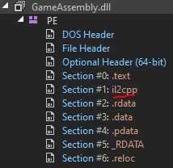

# GemHunter

Category: Rev (SPOILER: this is a scam)

We are given a [BestGame.zip](./BestGame.zip), that contains, well a unity game, in which you collect coins and touch the prize. However, no flag appears upon completion of the game. Maybe it is hidden somewhere?

We put the `GameAssembly.dll` into [dnSpy](https://github.com/dnSpy/dnSpy) and we see that it is il2cpp:


Since this is in the rev category, let's use [Cpp2IL](https://github.com/SamboyCoding/Cpp2IL) to try to get back the c# code.

```
Cpp2IL.exe --game-path "path\to\BestGame" --exe-name "BestGame" --experimental-enable-il-to-assembly-please --throw-safety-out-the-window
```

a `cpp2il_out` gets outputted. We open the DLLs in [ILSpy](https://github.com/icsharpcode/ILSpy) (dnSpy also works too I just felt like using ILSpy) and go to the `Assembly-CSharp.dll`, which is the dll that usually contains all the game logic for Unity games.

We look through the classes that are there, and found `PlayerMovement.OnTriggerEnter2D()`:


```cs
// Assembly-CSharp, Version=0.0.0.0, Culture=neutral, PublicKeyToken=null
// PlayerMovement
using System;
using System.Text;
using Cpp2IlInjected;
using UnityEngine;
using UnityEngine.UI;

[Cpp2IlInjected.Token(Token = "0x6000004")]
[Cpp2IlInjected.Address(RVA = "0x1B33E0", Offset = "0x1B23E0", VA = "0x1801B33E0")]
private void OnTriggerEnter2D(Collider2D other)
{
	//Discarded unreachable code: IL_00c3
	if (other.gameObject.CompareTag("Coin"))
	{
		UnityEngine.Object.Destroy(other.gameObject);
	}
	if (other.gameObject.CompareTag("Funny"))
	{
		UnityEngine.Object.Destroy(other.gameObject);
	}
	if (other.gameObject.CompareTag("Prize") && coinCount == 12)
	{
		UnityEngine.Object.Destroy(other.gameObject);
		int num = 0;
		byte[] array = Convert.FromBase64String("EDQ+NDB2qwFWuyhgVCwFO2yLNF/KcDcGIyMKTIwSTLorJho=");
		int num2 = 0;
		if (num2 < array.Length)
		{
			float[] array2 = keys;
			num2 = num;
			num2++;
		}
		int num3 = 0;
		string @string = Encoding.UTF8.GetString(array);
		decryptedString = @string;
		Text flag = Flag;
		string text = decryptedString;
		flag.text = text;
		Text flag2 = Flag;
	}
}
```

It looks like we can just un-base64 the `"EDQ+NDB2qwFWuyhgVCwFO2yLNF/KcDcGIyMKTIwSTLorJho="` but that gives us gibberish.

It looks like when we touch prize, a certain textbox somewhere gets updated with the flag. But where is the textbox?