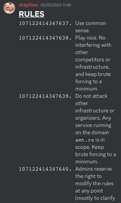

# Insanity check

Category: misc  
Author: hellopir2

One day, I woke up at 0230 UTC, and realised it was the day AmateursCTF started. I was late, but also lazy, so I pulled out my phone to check stuff out on discord. When I looked at the rules, I saw this:



The numbering was increasing by one from `107122414347637`. I was a little sus and felt like the number wasn't just arbitrary or a bug, but it also didnt mean anything to me at the time, so I just got up from bed and went to do stuff.

Later, I was looking at the chal:

> insanity introduce inspire something incredible impulse ivory intelligence incident implication hidden illustrate isolation illusion indirect instinct inappropriate interrupt infection in item inspector institution infinite insert the insist import ignite incentive influence instruction invasion install infrastructure innovation ignore investment impact improve increase rules identification initial immune inhabitant indulge illness information iron injection interest intention inquiry inflate impound

At first glance, it seems like some wordlist of i-words, but there are actually some words hidden in the text:

> something hidden in the rules

This likely refers to the #rules channel in the Discord server, which made sense if this was related to sanity check.

At first, I wondered if it might be a steg of the iceberg image, but I just didn't like that possibility (steg ptsd). Then, I noticed that the "1" in the list numbering looked a little different from the regular Discord "1":

 (numbered list)  
 (regular)

That's when I remembered the strange numbering from that morning! I right-clicked the message, clicked "Copy Text", and pasted it:

```
# __RULES__
107122414347637. Use common sense.
125839376402043. Play nice. No interfering with other competitors or infrastructure, and keep brute forcing to a minimum.
122524418662265. Do not attack other infrastructure or organizers. Any service running on the domain `amt.rs` is in scope. Keep brute forcing to a minimum.
122549902405493. Admins reserve the right to modify the rules at any point (mostly to clarify things).
121377376789885. PLEASE DO NOT COMMUNICATE WITH ADMINS THROUGH DMS, **USE THE MODMAIL/TICKET BOT INSTEAD**
Good job for reading the rules. Here's your sanity check flag: `amateursCTF{be_honest._did_you_actually_read_the_rules?}`
## vv anything in the red box is disallowed (yes that means flag hoarding is banned)
```

This is clearly different from what appeared on my phone, probably caused by Discord iOS rendering the list numbering with consecutive numbers that start from the first number actually typed (`107122414347637` in this case), whereas the Windows client just starts it with 1.

I didn't notice anything else of interest, so I started working on the numbers. I first tried converting them from decimal to hex individually, then converting that into text... oh it worked lol

[CyberChef Recipe](https://gchq.github.io/CyberChef/#recipe=Fork('%5C%5Cn','',false)To_Base(16)Merge(true)From_Hex('Auto')&input=MTA3MTIyNDE0MzQ3NjM3CjEyNTgzOTM3NjQwMjA0MwoxMjI1MjQ0MTg2NjIyNjUKMTIyNTQ5OTAyNDA1NDkzCjEyMTM3NzM3Njc4OTg4NQ)

flag: `amateursCTF{oops_you_found_me}`

We ended up getting the second solve (blooded by Social Engineering Xperts before I woke up)

If not for that initial reading of the rules in the morning, the solve would probably have taken far longer, or might not even have happened (or worse, I actually go insane trying to steg the iceberg...)

Thank you for being inconsistent, Discord :)