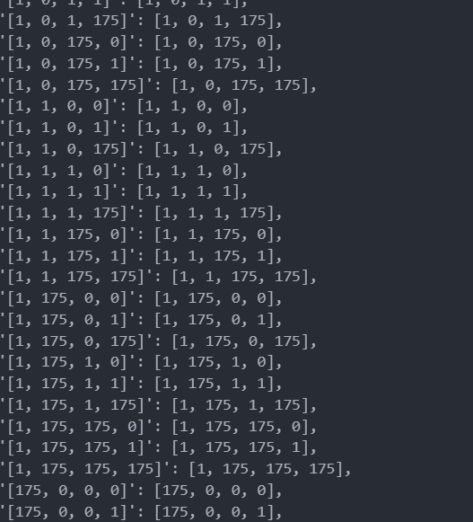

# Minimalaestic

category: crypto

author: `hellopir2`

> You know how aes is supposed to be like good at encrypting and like fast and stuff? What if i like inverted all of that and then like you know made it take forever to run and then make it really bad at encrypting...

We are given an insanely long `main.py`:

```py
# based on https://github.com/boppreh/aes/blob/master/aes.py
from flag import flag, key
import copy
KEY_SIZE = 2
ROUNDS = 100

def sub_bytes(s):
    for i in range(2):
        s[i][0] = sbox[s[i][0]]

def final_sub(s):
    for i in range(2):
        s[i][1] = sbox[s[i][1]]

sbox = [0x63, 0x7C, 0x77, 0x7B, 0xF2, 0x6B, 0x6F, 0xC5, 0x30, 0x01, 0x67, 0x2B, 0xFE, 0xD7, 0xAB, 0x76,
        0xCA, 0x82, 0xC9, 0x7D, 0xFA, 0x59, 0x47, 0xF0, 0xAD, 0xD4, 0xA2, 0xAF, 0x9C, 0xA4, 0x72, 0xC0,
        0xB7, 0xFD, 0x93, 0x26, 0x36, 0x3F, 0xF7, 0xCC, 0x34, 0xA5, 0xE5, 0xF1, 0x71, 0xD8, 0x31, 0x15,
        0x04, 0xC7, 0x23, 0xC3, 0x18, 0x96, 0x05, 0x9A, 0x07, 0x12, 0x80, 0xE2, 0xEB, 0x27, 0xB2, 0x75,
        0x09, 0x83, 0x2C, 0x1A, 0x1B, 0x6E, 0x5A, 0xA0, 0x52, 0x3B, 0xD6, 0xB3, 0x29, 0xE3, 0x2F, 0x84,
        0x53, 0xD1, 0x00, 0xED, 0x20, 0xFC, 0xB1, 0x5B, 0x6A, 0xCB, 0xBE, 0x39, 0x4A, 0x4C, 0x58, 0xCF,
        0xD0, 0xEF, 0xAA, 0xFB, 0x43, 0x4D, 0x33, 0x85, 0x45, 0xF9, 0x02, 0x7F, 0x50, 0x3C, 0x9F, 0xA8,
        0x51, 0xA3, 0x40, 0x8F, 0x92, 0x9D, 0x38, 0xF5, 0xBC, 0xB6, 0xDA, 0x21, 0x10, 0xFF, 0xF3, 0xD2,
        0xCD, 0x0C, 0x13, 0xEC, 0x5F, 0x97, 0x44, 0x17, 0xC4, 0xA7, 0x7E, 0x3D, 0x64, 0x5D, 0x19, 0x73,
        0x60, 0x81, 0x4F, 0xDC, 0x22, 0x2A, 0x90, 0x88, 0x46, 0xEE, 0xB8, 0x14, 0xDE, 0x5E, 0x0B, 0xDB,
        0xE0, 0x32, 0x3A, 0x0A, 0x49, 0x06, 0x24, 0x5C, 0xC2, 0xD3, 0xAC, 0x62, 0x91, 0x95, 0xE4, 0x79,
        0xE7, 0xC8, 0x37, 0x6D, 0x8D, 0xD5, 0x4E, 0xA9, 0x6C, 0x56, 0xF4, 0xEA, 0x65, 0x7A, 0xAE, 0x08,
        0xBA, 0x78, 0x25, 0x2E, 0x1C, 0xA6, 0xB4, 0xC6, 0xE8, 0xDD, 0x74, 0x1F, 0x4B, 0xBD, 0x8B, 0x8A,
        0x70, 0x3E, 0xB5, 0x66, 0x48, 0x03, 0xF6, 0x0E, 0x61, 0x35, 0x57, 0xB9, 0x86, 0xC1, 0x1D, 0x9E,
        0xE1, 0xF8, 0x98, 0x11, 0x69, 0xD9, 0x8E, 0x94, 0x9B, 0x1E, 0x87, 0xE9, 0xCE, 0x55, 0x28, 0xDF,
        0x8C, 0xA1, 0x89, 0x0D, 0xBF, 0xE6, 0x42, 0x68, 0x41, 0x99, 0x2D, 0x0F, 0xB0, 0x54, 0xBB, 0x16]

def shift_rows(s):
    s[0][0], s[1][0] = s[1][0], s[0][0]

def final_shift(s):
    s[0][1], s[1][1] = s[1][1], s[0][1]

def mix_column(column):
    column[0] = column[0] ^ column[1]
  
def mix_columns(state):
    for i in range(2):
        column = []
        for j in range(2): column.append(state[i][j])
        mix_column(column)
        for j in range(2): state[i][j] = column[j]

def add_round_key(s, k):
    for i in range(2):
        for j in range(2):
            s[i][j] ^= k[k[k[k[i*2+j]%4]%4]%4]

def final_add(s, k):
    for i in range(2):
        s[i][1] ^= k[k[k[k[i*2+1]%4]%4]%4]

def schedule_key(k):
    for i in range(4):
        for j in range(2*ROUNDS):
            k[i] = pow(pow(sbox[sbox[sbox[((((k[i] << 4) ^ k[i]) << 4) ^ k[i]) % 256]]], pow(k[i], k[i]), 256), pow(sbox[k[i]], sbox[k[i]]), 256)

def final_schedule(k):
    for i in range(4):
        k[i] = sbox[k[i]]

def bytes2matrix(text):
    return [list(text[i:i+2]) for i in range(0, len(text), 2)]

def matrix2bytes(matrix):
    return bytes(sum(matrix, []))

def pad(plaintext):
    padding_len = 4 - (len(plaintext) % 4)
    padding = bytes([padding_len] * padding_len)
    return plaintext + padding

def unpad(plaintext):
    padding_len = plaintext[-1]
    assert padding_len > 0
    message, padding = plaintext[:-padding_len], plaintext[-padding_len:]
    assert all(p == padding_len for p in padding)
    return message

def split_blocks(message, block_size=4, require_padding=True):
        assert len(message) % block_size == 0 or not require_padding
        return [message[i:i+4] for i in range(0, len(message), block_size)]

def encrypt(p, k):
    ciphertext = b""
    for i in split_blocks(pad(p)):
        key = k.copy()
        i = bytes2matrix(i)
        add_round_key(i, key)
        for j in range(ROUNDS):
            schedule_key(key)
            sub_bytes(i)
            shift_rows(i)
            mix_columns(i)
            add_round_key(i, key)
        final_schedule(key)
        final_sub(i)
        final_shift(i)
        final_add(i, key)
        ciphertext += matrix2bytes(i)
    return ciphertext


print(encrypt(flag, key).hex())
```
and its output.txt:

```
96ee25dc3ff357b3a45dc08ff2f3f05038b308d30feef350c63fa72e0acafbff673997b7632c5f53c0b32767c7f382deedb39f24d0bff0e1efe31bb73c6e2dd3eabbf047fd0bcc27
```

As a crypto main I am unironically allergic to reading long code so this might have been the most painful challenge. But to save you from the torture I will just explain what each function does in order of appearance in `encrypt`:

`pad`: append bytes to the end until bytestring length is multiple of 4

`split_blocks`: split message until blocks of length 4

`bytes2matrix`: split each block into 2 groups of 2 bytes

`add_round_key`: xor every byte with `k[k[k[k[i*2+j]%4]%4]%4]` where k is the key

`schedule_key`: i in range(4), j in range(200), `k[i] = pow(pow(sbox[sbox[sbox[((((k[i] << 4) ^ k[i]) << 4) ^ k[i]) % 256]]], pow(k[i], k[i]), 256), pow(sbox[k[i]], sbox[k[i]]), 256)` 🤢

`sub_bytes`: `s[0][0]` and `s[1][0]` get replaced with sbox indexed at their values

`split_rows`: swap rows

`mix_columns`: col1 = col1 xor col2

`final_schedule`: replace every value in key with sbox indexed at their values

`final_sub`: replace `s[0][1]` and `s[1][1]` with sbox indexed at their values

`final_shift`: swap `s[0][1]` and `s[1][1]`

`final_add`: xor `s[0][1]` and `s[1][1]` with  `k[k[k[k[i*2+1]%4]%4]%4]`

Being that our goal is to reverse `encrypt`, we will have to try to reverse all these functions. They are mostly easy to reverse, except the notably complex ones:

`add_round_key`, `schedule_key`, `final_add`, especially since we don't have the key.

As usual with these type of challenges, the first thing to do is to mess around with the functions and try to make some observations. The most relevant preliminary observations I made were:

1. Since this cipher processes each block of 4 bytes independently, I can expect encrypted `amat` to match with the corresponding first 4 bytes of the encrypted message

2. `schedule_key` always gives values of 0, 1 or 175.

3. `add_round_key` will moderately frequently will xor all the values with the same value, or with a list of only two different values

So, since `add_round_key` is only called once with the original key, I could brute force xor `amat` with a list of the same or two different numbers. Then, `schedule_key` is run before using the key again, so I can then brute force every possible list of length 4 with values 0, 1, 175 as the key from then on.

This is the code which brute-forces that with a key as the same value 4 times. Here I am banking on the actual 25% chance that the key is actually the same value repeated.

```py
import itertools
aesed = bytes.fromhex("96ee25dc3ff357b3a45dc08ff2f3f05038b308d30feef350c63fa72e0acafbff673997b7632c5f53c0b32767c7f382deedb39f24d0bff0e1efe31bb73c6e2dd3eabbf047fd0bcc27")
keys = [list(x) for x in list(itertools.product([0,1,175], repeat=4))]
for k in range(128):
    i = [[97^k, 109^k], [97^k, 116^k]]
    for key in keys:
        for j in range(ROUNDS):
            if j>0: schedule_key(key)
            sub_bytes(i)
            shift_rows(i)
            mix_columns(i)
            add_round_key(i, key)
        #print(i)
        #print(key)
        final_schedule(key)
        final_sub(i)
        final_shift(i)
        final_add(i, key)
        if matrix2bytes(i) == aesed[:4]:
            print(k)
            print(key)
```

So, I distributed this code to my teammates and prayed that the key was just nice to us. Then, hemi had the idea of running a profiler to check which function was causing the most functions, and to see whether we could optimize it.

```py
[175, 175, 175, 175]
         25750569 function calls in 299.963 seconds

   Ordered by: standard name

   ncalls  tottime  percall  cumtime  percall filename:lineno(function)
        4    0.000    0.000    0.000    0.000 <frozen importlib._bootstrap>:198(cb)
        1    0.153    0.153  299.963  299.963 main.py:1(<module>)
        1    0.000    0.000    0.000    0.000 main.py:109(<listcomp>)
     8100    0.010    0.000    0.010    0.000 main.py:29(shift_rows)
       81    0.000    0.000    0.000    0.000 main.py:32(final_shift)
    16200    0.013    0.000    0.013    0.000 main.py:35(mix_column)
     8100    0.154    0.000    0.197    0.000 main.py:38(mix_columns)
     8100    0.166    0.000    0.166    0.000 main.py:4(sub_bytes)
     8100    0.087    0.000    0.087    0.000 main.py:45(add_round_key)
       81    0.000    0.000    0.000    0.000 main.py:50(final_add)
     8019    3.742    0.000  299.346    0.037 main.py:54(schedule_key)
       81    0.000    0.000    0.000    0.000 main.py:59(final_schedule)
       81    0.002    0.000    0.002    0.000 main.py:66(matrix2bytes)
       81    0.000    0.000    0.000    0.000 main.py:8(final_sub)
      162    0.000    0.000    0.001    0.000 utf_8.py:19(encode)
      162    0.000    0.000    0.000    0.000 {built-in function _codecs.utf_8_encode}
        4    0.000    0.000    0.000    0.000 {built-in function _imp.acquire_lock}
        4    0.000    0.000    0.000    0.000 {built-in function _imp.release_lock}
        1    0.000    0.000  299.963  299.963 {built-in function exec}
 25660800  295.604    0.000  295.604    0.000 {built-in function pow}
    32400    0.030    0.000    0.030    0.000 {method 'append' of 'list' objects}
        1    0.000    0.000    0.000    0.000 {method 'disable' of '_lsprof.Profiler' objects}
        1    0.000    0.000    0.000    0.000 {method 'fromhex' of 'type' objects}
        4    0.000    0.000    0.000    0.000 {method 'get' of 'dict' objects}
```

`schedule_key` is the function causing ALL of the problems entirely. So, taking a closer look at it again:

```py
def schedule_key(k):
    for i in range(4):
        for j in range(2*ROUNDS):
            k[i] = pow(pow(sbox[sbox[sbox[((((k[i] << 4) ^ k[i]) << 4) ^ k[i]) % 256]]], pow(k[i], k[i]), 256), pow(sbox[k[i]], sbox[k[i]]), 256)
```

I realise that the value that the key is xoring with, is deterministic based on `k[i]`. So, I can create a lookup table for the value to be xored with based on `k[i]`, and that way I can do this instantly instead of whatever this is.

So, I created a lookup table:

```py
keys = [list(x) for x in list(itertools.product([0,1,175], repeat=4))]
def schedule_key2(k):
    for i in range(4):
        for j in range(2*ROUNDS):
            k[i] = pow(pow(sbox[sbox[sbox[((((k[i] << 4) ^ k[i]) << 4) ^ k[i]) % 256]]], pow(k[i], k[i]), 256), pow(sbox[k[i]], sbox[k[i]]), 256)
    return k

keytable = dict()
for key in keys:
    keytable[str(key)] = schedule_key2(key)
keytable
```



Oh my god. To my horror or maybe delight, `schedule_key` literally somehow returns the same exact key. Until now, I have no idea why, but its likely because they chose a function where 0,1,175 would all return themselves.

So, we can literally just remove the schedule_key function altogether. This is the new code (I tried key with just the same value and it didn't work, so I moved on to two values in key):

```py
for f in tqdm(range(128)):
    for ff in range(f+1, 128):
        for k in [list(x) for x in list(itertools.product([f, ff], repeat=4))]:
            for key2 in keys:
                i = [[97^k[0], 109^k[1]], [97^k[2], 116^k[3]]]
                key = key2.copy()
                for j in range(ROUNDS):
                    
                    sub_bytes(i)
                    shift_rows(i)
                    mix_columns(i)
                    add_round_key(i, key)
                #print(i)
                #print(key)
                final_schedule(key)
                final_sub(i)
                final_shift(i)
                final_add(i, key)
                if matrix2bytes(i) == aesed[:4]:
                    print(k)
                    print(key2)
                    print("GG!!")
```

Which, in just 30 seconds prints

```
[0, 42, 42, 0]
[1, 0, 0, 1]
GG!!
[0, 42, 42, 0]
[1, 0, 175, 1]
GG!!
```

This was expected to maybe take an hour, but we got really lucky since the key started with 0.

Now with the key, all we have to do is reverse all the steps of encryption, which isn't that hard. The key used in `final_add` can be obtained by just running `final_schedule` with `[0, 42, 42, 0]` which gives `[124, 99, 99, 124]`

Here's the final code:

```py
def decrypt(part):
    k = [1, 0, 0, 1]
    finalkey = [124, 99, 99, 124]
    i = bytes2matrix(part).copy()
    final_add(i, finalkey)
    final_shift(i)
    i[0][1] = sbox.index(i[0][1])
    i[1][1] = sbox.index(i[1][1])
    for _ in range(ROUNDS):
        add_round_key(i,k)
        mix_columns(i)
        shift_rows(i)
        i[0][0] = sbox.index(i[0][0])
        i[1][0] = sbox.index(i[1][0])
    return xor(matrix2bytes(i),[0,42,42,0])
b"".join([decrypt(aesed[x:x+4]) for x in range(0,len(aesed),4)])
```

which gives `amateursCTF{th1s_1s_wh4t_bad_k3y_sch3dul1ng_d03s_t0_a_p3rson_109bcd1f}\x02\x02`